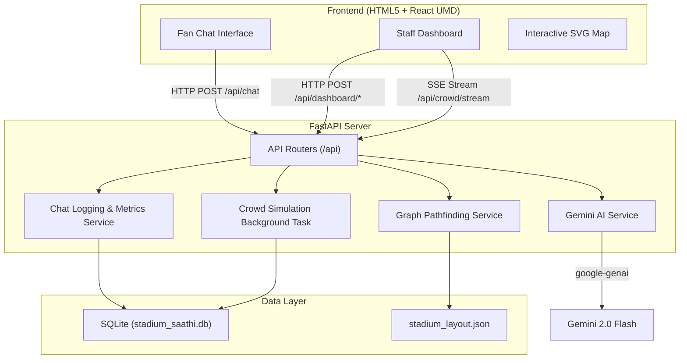

# Stadium Saathi — FIFA World Cup 2026 Assistant

Stadium Saathi is a GenAI-powered multi-language assistant, smart indoor navigation system, and real-time crowd safety alert simulator built for visitors and staff at FIFA World Cup 2026 venues.

It features a unified chat assistant for fans and a real-time analytics command dashboard for stadium operations/staff.

---

## Key Features

1. **Multi-language Chat Assistant**
   - Automatically detects and responds in the same language the fan uses (Hindi, English, Spanish, French, Arabic, Portuguese, etc.).
   - Powered by **Google Gemini 2.0 Flash** for translation, intent classification, and natural response formatting.
   
2. **Smart Indoor Navigation**
   - Stores stadium coordinates, gates, sections, food stalls, washrooms, and first-aid rooms.
   - Algorithmic shortest path routing (Dijkstra's) determines waypoints, which Gemini translates into natural step-by-step guidance.

3. **Real-time Crowd Alert & Rerouting**
   - Simulates live crowd density sensors across stadium zones.
   - Automatically reroutes fans away from high-density or critical zones and warns them proactively.

4. **Staff / Volunteer Dashboard**
   - Simple password-gated dashboard displaying live metric cards.
   - Interactive zone crowd heatmap, live emergency alerts feed, and analytics for frequent queries and language breakdown.

---

## Tech Stack

- **Backend**: FastAPI (Python 3.11+), SQLAlchemy, aiosqlite (async SQLite database).
- **AI Engine**: Google Gemini API via the official `google-genai` Python SDK.
- **Frontend**: Single Page React Application loaded with Tailwind-equivalent Vanilla CSS, Lucide icons, and in-browser Babel compilation (no Node/NPM required, runs out-of-the-box).
- **Deployment**: Configured for local docker-compose and Google Cloud Run.

---

## Architecture Diagram



---

## How GenAI is Used at Each Step

| Step / Feature | Gemini Model | System prompt & Role | Output Format |
|---|---|---|---|
| **Intent Extraction** | `gemini-2.0-flash` | Extracts language, intent category (greeting, navigation, facility_query, emergency, general_info), start/end locations, and facility types. | Structured JSON |
| **Response Generation** | `gemini-2.0-flash` | Translates navigation directions, greets users, or flags emergency notifications in the fan's native language. | Markdown / Plain Text |
| **Emergency Detection** | `gemini-2.0-flash` | Safely evaluates messages for critical keywords/intents (distress, health issues, safety) and logs them for immediate staff intervention. | Boolean flag |
| **Crowd-Aware Rerouting** | `gemini-2.0-flash` | Incorporates live sensor warning texts to advise fans on *why* they were rerouted (e.g. "Gate A is congested, please enter via Gate B"). | Natural phrasing in same language |

---

## Setup & Running Locally

### Prerequisites
- Python 3.11+
- Google Gemini API Key (Get one from [Google AI Studio](https://aistudio.google.com/apikey))
  - *If you don't have a Gemini API key, the app runs in **Mock Mode** using rule-based local simulation!*

### Installation Steps

1. **Clone or navigate** to the project directory:
   ```bash
   cd C:\Users\abhin\.gemini\antigravity\scratch\stadium-saathi
   ```

2. **Create a virtual environment**:
   ```bash
   python -m venv venv
   ```

3. **Activate the virtual environment**:
   - **Windows (PowerShell)**:
     ```powershell
     .\venv\Scripts\Activate.ps1
     ```
   - **macOS/Linux**:
     ```bash
     source venv/bin/activate
     ```

4. **Install backend dependencies**:
   ```bash
   pip install -r backend/requirements.txt
   ```

5. **Configure environment variables**:
   Create a `.env` file in the `backend` folder (or copy `.env.example`):
   ```ini
   GEMINI_API_KEY=your_actual_gemini_api_key_here
   DASHBOARD_PASSWORD=stadium_saathi_admin_2026
   DATABASE_URL=sqlite+aiosqlite:///./stadium_saathi.db
   ENVIRONMENT=development
   ```

6. **Start the FastAPI Server**:
   ```bash
   cd backend
   python -m uvicorn app.main:app --reload --port 8000
   ```

7. **Access the application**:
   Open your browser and navigate to:
   - **Fan Chat & Navigation**: [http://localhost:8000](http://localhost:8000)
   - **Staff Dashboard**: Click the "Staff Dashboard" button in the navigation bar. Enter the password `stadium_saathi_admin_2026` to unlock.

---

## Docker Deployment

To build and run the full stack container locally:

```bash
docker build -t stadium-saathi .
docker run -p 8080:8080 -e GEMINI_API_KEY="your_api_key" stadium-saathi
```
The application will be available at [http://localhost:8080](http://localhost:8080).
